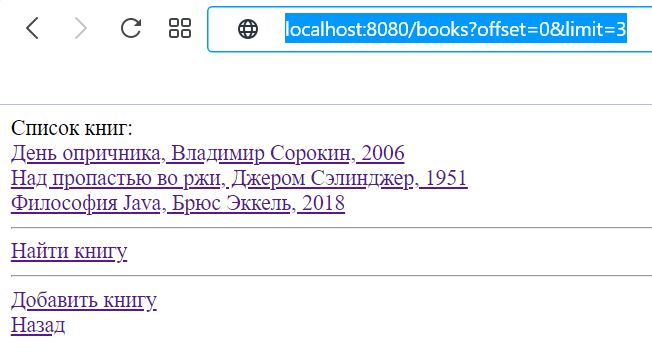
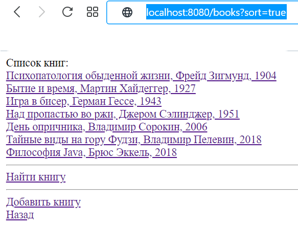
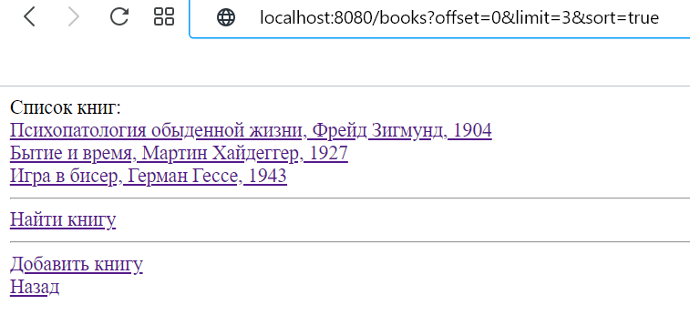
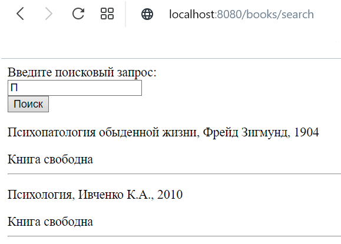
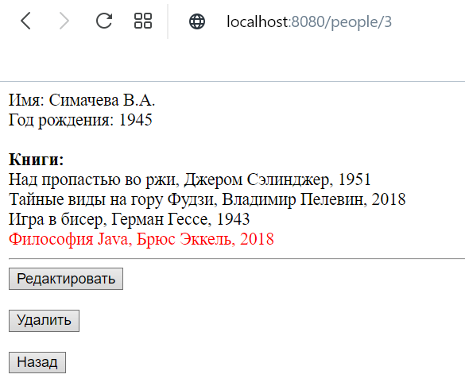

## Проект "Электронная библиотека" версия 2.0
### Описание:
Модернизированный вариант CRUD приложения "Электронная библиотека": добавлены новые возможности приложения, местами исправлен код.
### Добавленный функционал:

1) Пагинация списка книг. Два ключа в параметре запроса (?offset="какую страницу запрашиваем" & limit="кол-во книг на одной странице").
Если ключи отсутствуют в запросе, книги передаются как обычно.

  

2) Сортировка книг по году. Ключ в параметре запроса (?sort=true). Если ключ отсутствует, книги сортируются по умолчанию.

  

3) Совмещение пагинации и сортировки.

  

4) Страница поиска книг.

  

5) Проверка на наличие просроченной даты по возврату книги (просроченная книга выделяется красным), установленный срок возврата 10 дней.

  
